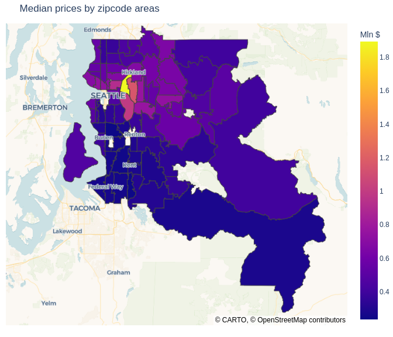
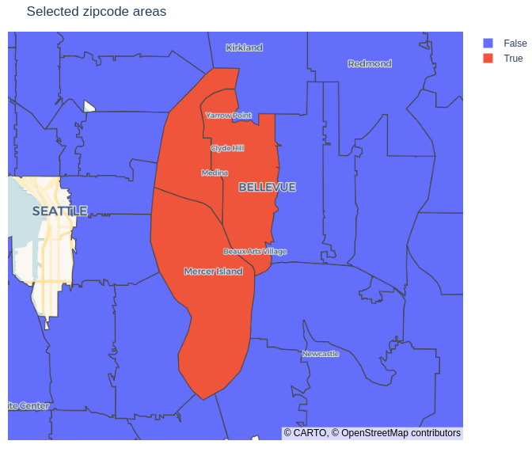
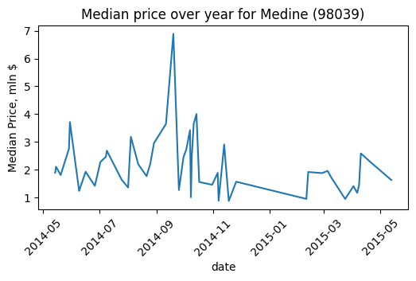
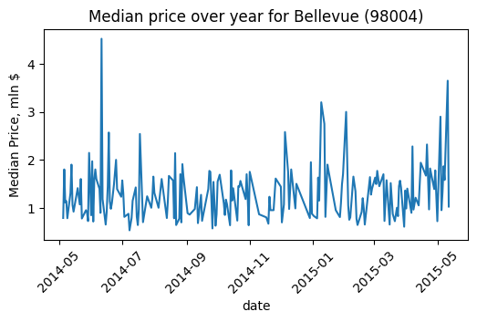
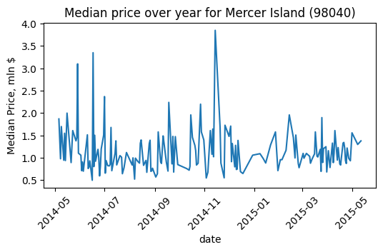
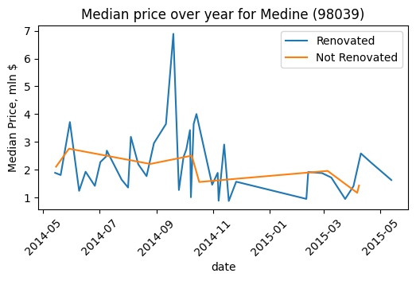
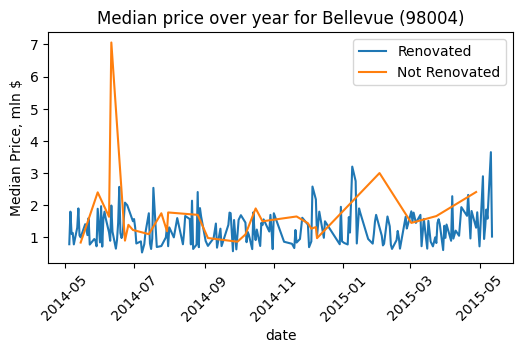
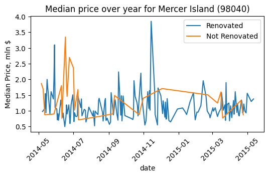

# Timoty Stevens

_Owns expensive houses in the center, needs to get rid, best timing within a year, open for renovation when profits rise_

## Stages of Data Acquisition and Initial Processing:

1. Extracting data from an SQL database
1. Caching the retrieved data to disk
1. Determining correct column data types
1. Saving processed results to a .PKL file while preserving column data types

## Geodata Acquisition and Processing:

1. Extract a list of existing ZIP codes from the data obtained in the previous stage
1. Download a GeoJSON file for Washington County from the internet
1. Filter only the relevant/used geographical areas
1. Saving processed results to a .json file

## Find the high priced center of the King County DC Washington USA

First, it was necessary to clarify which specific districts were being referenced. 
I analyzed districts with the highest median and maximum prices.

Key Findings:

* The three districts with the highest median prices were also among the top five districts with the highest transaction prices.
    

However, since maximum price depends on specific property characteristics and cannot reliably represent general market prices, I concluded that these three recurring districts likely represent areas where the client owns property.

* 98039 - Medine
* 98004 – Bellevue, etc.
* 98040 – Mercer Island

## Identifying Optimal Property Listing Seasons

I proceeded to analyze seasonal price trends to determine the most profitable time to sell real estate.

Key Observations:

* After examining price fluctuations per district, the results were inconclusive.
* While price volatility was higher in spring, the overall trend remained unclear—likely due to limited transaction data in these areas.
* However, periods with greater price fluctuations still present opportunities to sell at higher prices compared to stable periods.

__Medine, Bellevue and Mercer Island__ - Highest volatility occurred in spring, while __Bellevue and Mercer Island Districts__ has significant price swings in winter too. As a conclusion - to sell the property in spring.

## How renovations affect sale prices

I compared transaction prices for renovated vs. non-renovated properties.

Key findings:

* Renovated properties consistently sold in mid-to-high price ranges.
* The most significant premium appeared during previously identified active seasons:
    * In spring, renovated properties outperformed non-renovated ones across the board.
    * In districts __Bellevue and Mercer Island__, this effect extended to winter sales.

Interpretation:

While renovations universally added value, their price-boosting power intensified during high-activity periods—aligning with the earlier volatility patterns.

## Seasonal Trends and Market Dynamics

### Conventional Wisdom vs. Observed Data

It’s widely accepted that real estate prices in this region typically rise in spring, as buyers aim to close deals for summer occupancy. However, during the analyzed period:

Seasonal price fluctuations were unusually muted. The unseasonably warm winter of 2014–2015 reduced the typical winter slowdown, sustaining transaction activity

The King County unique profile can also explain anomaly of stable prices. Primarily this area populated by high-earning IT professionals with stable purchasing power. But it has a limited inventory of new properties. Persistent high demand + low supply suppressed normal seasonal volatility
