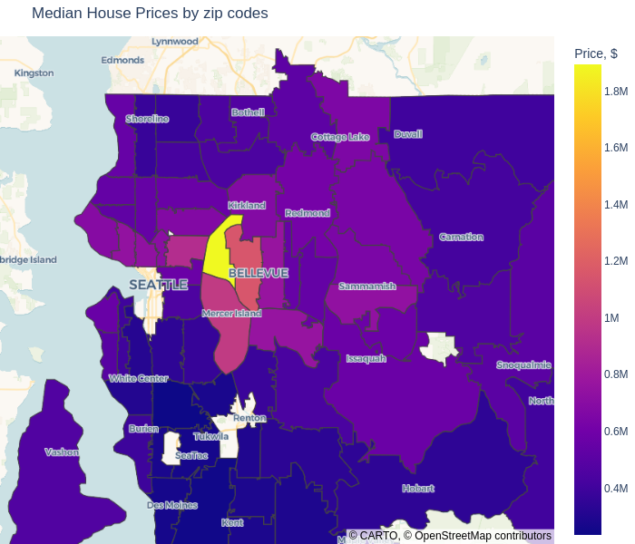
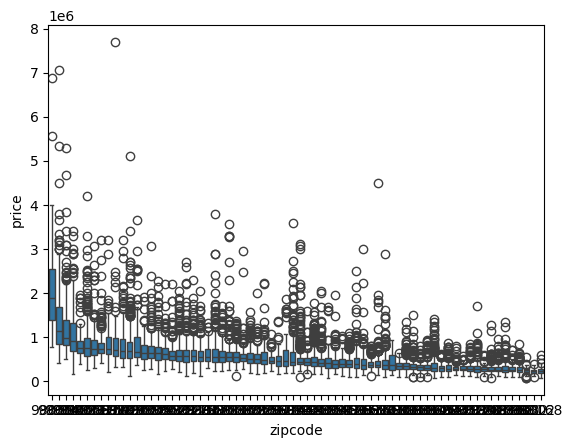

# Timoty Stevens

_Owns expensive houses in the center, needs to get rid, best timing within a year, open for renovation when profits rise_

## Find the center of the King County DC Washington USA

from the data set I've extracted the zipcodes list. geo json data was taken from here:
[WA_Washington_ZIP_codes_geo](https://github.com/OpenDataDE/State-zip-code-GeoJSON/blob/master/wa_washington_zip_codes_geo.min.json)

to make processing faster and remove unnecessary details from graphs I filtered out only codes used in data set.

Next step is to build a GEO map with points on place of the houses and their prices marks.

It is pretty obvious, that we can select about 6 top blocks, where the prices are highest and they are located in center area. To check, let's make a statistical investigation.

It is pretty obvious, that the most expensive houses located in the areas with highest median price. according to the diagram I can take highest 10 - 12 values, which is nicely matches with heatmap image

let's check this

[98039, 98004, 98040, 98112, 98005, 98006, 98119, 98075, 98109, 98102]
